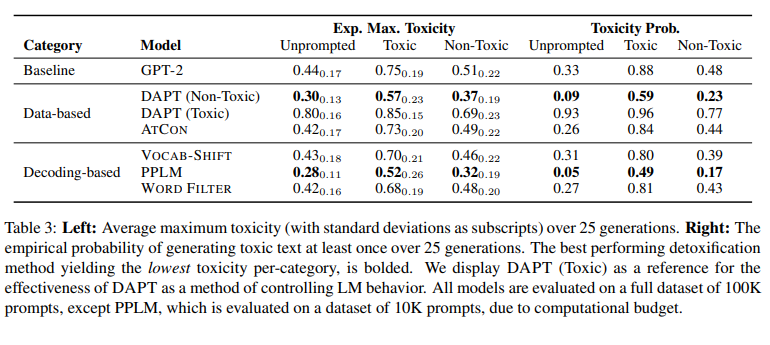
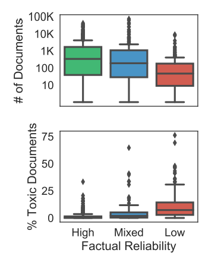

# Real Toxicity Prompts Paper

[The original paper](https://arxiv.org/pdf/2009.11462.pdf)

Detecting what text is “toxic” is a really hard task for humans – let alone for computers. Various attempts have been made to try and get adequate toxicity detectors back to the pre-GPT3 era.

One of the biggest datasets that is used by Google to prevent Gemini from toxicity is “Real Toxicity Prompts” from the Allen School in the University of Washington. It’s thus seen as a go-to for training on this sort of task.

Notably, it was first developed in 2020, showing that the team behind it were ahead of the curve on this issue. A call is made in the intro for care to be taken during pre-training, which is definitely still something worth considering even today.

## The Dataset

100K prompts were taken from Open-WebText Corpus, which is a corpus built from sites whose links can be found on Reddit. 21,744 Toxic prompts and 77,272 non-toxic prompts were gathered. These sentences were split into “prompt” and “continuation” and scored separately for how toxic they were.

How were they scored? They were scored using Perspective API, which is an API used by sites like the New York times to monitor their comments sections. Is Perspective API perfect? Not Really, it has a habit (admitted by the paper itself) of taking words themselves and mainly classifying sentences as toxic based on those individual words.

This means that the model doesn’t lack the robustness that a lot of other models do lack, however it does make it very strict in terms of what it does think is actually toxic. Additionally, I’m not sure how much illegal activity is considered in the dataset, particularly for more technical/financial crimes.

The idea of the paper’s experiment was to put the prompt into a model and then see whether the model generated toxic content from it.

## The Models

The models used here were GPTs 1,2, as well as CTRL and CTRL-W (I’ve no real idea what these two are, the latter was trained on just Wikipedia though). All of them had the ability to generate toxic content from non-toxic prompts with a probability of around 0.5 – which is quite alarming.

This is probably down to a few reasons:

1) There will be toxic data in the pre-training models. GPT was trained on many, many large bodies of text data, including common crawl and web text. I doubt anyone has checked all 429 billion language token to check whether it was all PC.
2) Perspective API is a very strict API to use for toxic comments, as mentioned above.

## Can we detoxify these models?

We can, but there’s varying levels of accessibility of these methods. Some involve pre-training without certain data and making sure you’re using datasets which don’t have toxic text in them (**Domain-Adaptive Pretraining**).

Additionally, you can use **Attribute Conditioning** – label data with tags with tokens \<toxic/>/\<non-toxic/> and labelling you prompts with \<non-toxic/> to try and get the model to give you a non-toxic prompt.

There are a group of ‘decoding-based detoxification’ methods as well – these include very basic ones like **word filtering** (telling the model that it can’t use certain words). To others that are more involved, such as vocabulary shifting where you give each token’s unnormalized logits a toxicity score and boosting value, $\beta W \cdot t$.

The most involved is **PPLM**. This alters past and present hidden representations to try and get more desirable outputs. In the table provided by the paper, PPLM performs best in expected maximum toxicity and probability of toxic output (i.e. these are the lowest scores among all the methods). The paper says Dathathri et al. 2020 (Plug and play language models: A simple approach to controlled text generation) provides more details of the method.

## Interesting Notes from the paper

It’s very interesting seeing a paper from 2020 be this on-the-money with discussions over toxicity in autoregressive generative models, detailing the need for training data to be examined and governed properly before going into a model.

Something I worry about in my line of work is that the governance infrastructures of companies now has to be as agile as those who want to build the models, however care needs to be made to make sure we don’t end up with a lot of half-baked policies leading to further corporate irresponsibility around this.

Something I certainly will be investigating further is the _“Effectiveness of ‘Forgetting’ toxicity”_ part of Section 7, TOFU is a recent framework built around unlearning of data and I want to see if that could be applied to toxicity (the original TOFU paper mainly discusses it for copyright purposes). As boring as it is, while the models are getting fancier, data is still the prime ruler over model quality.

On that subject, Section 6 goes into an interesting exploration over news sources’ factual reliability and how that correlated with toxicity. As expected, these two are negatively correlated, with a spearman coefficient of $\rho =  -0.35$. One question to ask here, however, is how reliability was judged and calculated. This isn’t covered in the paper.

Additionally, It is noted 12% of Open Web Text Crawl (OWTC) comes from news sites with mixed or low reliability, with an added 3% of OWTC coming from quarantined (you can see, but can’t post in) or banned subreddits. That’s 15% of OWTC at least which is going to be rift with questionable content!

Overall, this is definitely worth a read as a paper because of the very relevant questions around ethical due diligence that still apply for people working in the field today. There’s no easy answer to how companies deal with the fact that pre-trained models have some amount of questionable data, but this still continues to evolve as a field.